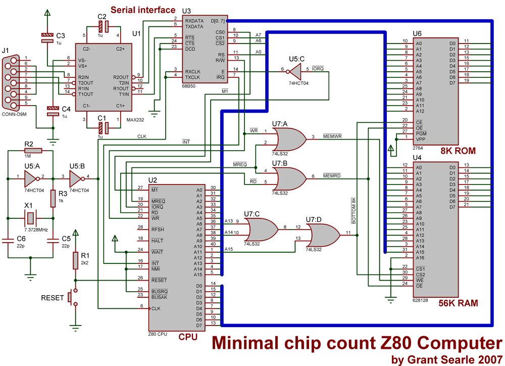

# Firth manual

Firth is a minimal (~4K) implementation of Forth for the Z80.


## Contents

- [Motivation](#Motivation)
- [Firth](#Firth)
  - [License](#License)
  - [Binaries](#Binaries)
  - [Building](#Building)
  - [Emulation](#Emulation)
  - [Hardware requirements](#Hardware-requirements)
  - [File layout](#File-layout)
- [The Forth architecture](#Forth-architecture)
  - [Why Forth?](#Why-forth)
  - [Data stack](#Data-stack)
  - [Execution model](#Execution-model)
  - [Defining words](#Defining-words)
  - [Compilation](#Compilation)
  - [Immediate words](#Immediate-words)
- [Control structures](#Control-structures)
  - [Conditional logic](#Conditional-logic)
  - [Looping structures](#Looping-structures)
- [Firth environment](#Firth-environment)
  - [Listing words](#Listing-words)
  - Debugging
- [Forth in Z80 Assembly](#Forth-in-Z80-Assembly)
  - Primitive words
  - Composite words
- [The Z80 architecture](#The-Z80-architecture)
  - Registers
  - Stack pointer
  - Index registers
  - Alternative registers
  - Memory addressing
  - Flags
  - I/O ports
- [Z80 Assembly language](#Z80-assembly-language)
  - Asm80
  - Directives
  - Variables
  - Macros
  - Structured assembler
- [Appendices](#Appendices)
  - [Firth words](#Firth-words)
  - [The Z80 instruction set](#The-Z80-instruction-set)
  - [Utility functions](#Utility-functions)
  - [Further reading](#Further-reading)
  - [Running unit tests](#Running-unit-tests)

<!--
## Motivation

A long time ago, I designed a computer kit with my friend Ken Stone which we called the TEC-1. It was a single-board computer kit which we published in Talking Electronics, a Melbourne-based electronics hobbyist magazine.

The configuration of the TEC-1 was a Z80 CPU with 2K of ROM and 2K of RAM. It also included a hexidecimal keyboard and a 6 digit 7-segment display.

The kit was quite successful and was released at a critical time in Australian computer history. A few thousand TEC-1 kits were sold and, as we learned over the years from people who remember the kit, it introduced many people to computing and programming for the very first time.

The kit continues on to this day with other people creating TEC-1 boards and new TEC-1s continue to be built by hobbyists. If they install version 1 of the monitor ROM that came with the original kit they're greeted with an old message from teen-age me:

`hello there this is the tec-1 ... designed by john hardy for TE!`

In its original form, the TEC-1 offered very little to the programmer. All code needs to be hand assembled and hand entered in via the hexadecimal keyboard. I always wanted to provide the TEC-1 one with a proper programming environment.

Fast-forward to the modern era, I started to think about augmenting the TEC-1 circuit with a proper serial interface. I then went to consider (before rejecting) adding a BASIC interpreter to the TEC-1. Instead I decided to pursue another longtime interest of mine (which also dates from the early 80s) I decided that what the TEC-1 needed was a self-hosted programming environment based on Charles Moore's [Forth](https://en.wikipedia.org/wiki/Forth) programming language.

This is where Firth comes from. "Firth" is named after the [Firth of Forth](https://en.wikipedia.org/wiki/Firth_of_Forth) an estuary on the river Forth in Scotland -- for no other reason than it's a cool-sounding name although it could be because this is also my "first Forth".
-->

## Firth

### License

Firth is released until the GNU General Public License Version 3. See the `LICENSE` file in the root folder.

[Back to contents](#contents)

### Binaries

TODO: Create a folder containing ROM images for various configurations.

[Back to contents](#contents)

### Building

Firth can be built using the ASM80 assembler and can be built at the [ASM80](https://www.asm80.com/) site by the following steps:

1. Press the `Import repo from GitHub` button
2. Paste the following repo name `https://github.com/jhlagado/firth` and click OK
3. Select the `main.z80` file
4. Download a .bin format binary by clicking on the "Download BIN" button. There are also buttons for downloading binaries in the .sna and .tap formats.

[Back to contents](#contents)

### Emulation

Firth can be emulated online by the following steps:

1. Press the `Import repo from GitHub` button
2. Paste the following repo name `https://github.com/jhlagado/firth` and click OK
3. Select the `main.z80` file
4. Press the `Emulator [F10]` button

This will cause ASM80 to start emulating the computer hardware specified in the `mycomputer.emu` file which is set up for a Z80 CPU which uses a Motorola 6850 ACIA serial chip mapped to ports $80 and $81.

The emulator will start up a green screen serial terminal emulation and present you with a prompt

```
Firth Z80

>
```

You can type Forth commands into it. e.g

```
> 1 2 3 * + .

7
```

You can exit the Forth interpreter by pressing the `Back to IDE` button on the top right corner.

[Back to contents](#contents)

### Hardware requirements

Firth is designed to be run in ROM of a Z80 computer board like the TEC-1. It could also be easily adapted to run on similar systems such as [Grant Searle's 7-chip Z80 computer](http://zx80.netai.net/grant/z80/SimpleZ80.html) and the [RC2014 Z80 single-board computer](https://rc2014.co.uk/).

To run Firth on a TEC-1 it some requires additional hardware to expand the memory and run the serial interface. **TODO: details of this additional hardware.** Firth is designed to run using a Motorola 6850 ACIA serial chip mapped to ports `$80` and `$81` (or `0x80` and `0x81`) as per the hardware arrangement designed by Grant Searle. See the circuit diagram below and note how the 6850 ACIA chip is wired up.


[Back to contents](#contents)

### File layout

Here is a listing of Firth's source files with a brief description.

```
compiler-macros.z80     macros used to enable Forth control and loop structures in ROM
constants.z80           most of the constants need by Firth
dloop-macros.z80        macros used to enable Assembly language looping structures
macros.z80              macros used to implement repetitive Assembly language elements
main.z80                the main file of Firth (start here)
mycomputer.emu          engine configuration file for the asm80 online emulator
primitives.z80          Forth words which are written in assembly language
struct-macros.z80       macros used to enable Assembly language control structures
test-macros.z80         macros used to enable unit tests
tests.z80               unit tests to test various aspects of the Forth engine
utilities.z80           Utility subroutines used by
variables.z80           Memory locations defined in RAM
words.z80               Forth words which written in Forth
```

You can start by examining `main.z80` which is the root file which includes all the other files.

[Back to contents](#contents)

## The Forth architecture

### Why Forth?

Forth as a programming system has many characteristics which set it apart from other programming languages. It would be wrong to simply describe it as a language compiler like C or an interpreter as with traditional BASIC. It sits in the middle between compiler and interpreter and is its own unique thing with its own execution model.

Forth has been described as a "bottom-up" language because it builds up directly from a small number of assembly language primitives without imposing a significant number of abstractions. Forth can be bootstrapped to run from less than 2K of assembly language. Most of the Forth system is written in Forth itself.

Forth is self-hosting which means that it is possible to write and edit code within the Forth system itself as opposed to targeting it from another system. Forth's abstractions are easy to understand and they simplify the process of writing programs for a microprocessor. Unlike conventional compiler languages, Forth imposes very in the way of system overhead.

So why Forth? Because Forth can be written from a low base of assembly language, it becomes a relatively simple task to get Forth running on diverse range of CPUs. Forth is portable. It irons out the quirks and differences between instruction sets and presents the developer with a much smaller programming surface than traditional assembly language does. Forth unifies many low level programming tasks.

Forth is lightweight. Even a language designed for systems programming such as C is much more "high-level" than Forth and adds considerably more overhead in terms of program size, memory size and computational overhead. Forth programs are extremely compact and are often smaller than the same code written in assembly language.

There is a cost to this compactness however. Forth is usually slower than assembly but not greatly so. Forth is generally pretty fast and favourably comparable with compiled high-level languages. On some CPUs, Forth can be as efficient as machine code itself. This is _not_ the case with 8-bit CPUs however but Forth does significantly improve the productivity of programmers who target the Z80.

Forth integrates well with assembly language and offers the developer the ability to drop back down to assembly for performance sensitive sections of code. Forth never takes the developer far "from the metal". It does however offer them structured flow control and a unified approach to parameter passing which are features that are normally associated with high-level languages. Forth brings structured programming to low-level programming.

### Data stack

Forth is similar to other languages in that it uses a stack to send parameters to subroutines. Forth is unusual though in that it separates the manipulation of the stack from the subroutine calls themselves. It also uses the stack to return results back to the caller. Unlike C, Forth may return multiple results from a subroutine.

By interleaving stack manipulation with subroutine calls Forth has developed in an unusual style. It's syntax uses "reverse Polish" notation which means that Forth code begins with the parameters and ends with the action to be performed on it.

The data stack takes numbers. To push some numbers onto the stack, simply write them on the command line and hit `Return`.

For example:

```
1 2 3
```

The `.` command pops the last item off the stack and prints it. Therefore to print the numbers pushed on the stack in the reverse order simply type:

```
1 2 3 . . .
```

Remember to use spaces between. Forth with responds with the following output:

```
3 2 1
```

To demonstrate Forth's reverse polish syntax, consider the following Forth code for adding two numbers:

```
1 2 + .
```

Output:

```
3
```

This should be understood as:

- push 1 on the stack
- push 2 on the stack
- add the two items on the stack and push the result
- print the top of the stack

To see the power of this consider a sum that would normally need parentheses to express operator precedence.

E.g.

```
(3 + 1) * 2
```

In Forth's reverse Polish, we write:

```
3 1 + 2 * .
```

Output:

```
8
```

Forth uses a stack and reverse Polish notation to radically simply its syntax. While processing user input when the Forth parser encounters a literal number it immediately pushes it onto the stack. When it encounterss anything else it assumes it's an operation to be performed. These operations are called "words" and they command Forth to do things.

For example, when Forth encounters the word `+` it calls Forth's addition subroutine which adds the top two items on the stack and places the result back on the stack. When it encounters the word `*` it similarly calls the multiply subroutine. The word `.` prints the item left on the stack. Wehn Forth uses a stack item it removes it from the stack.

[Back to contents](#contents)

### Execution model

A word is a piece of reusable code which can be called with parameters which are pushed onto the stack, executes and then returns one or more results on the stack. Forth doesn't assume that the user of a word knows where it is located in memory, instead, the word is looked up in a data structure known as the "dictionary".

The dictionary is a singly linked list which starts at the most recently defined word. Each word in the dictionary has a header record of the form:

| previous word | flags & name length | name   | body   |
| ------------- | ------------------- | ------ | ------ |
| 2 bytes       | 1 byte              | char[] | byte[] |

The header starts with a pointer to the previous word in the dictionary and is followed by a byte which contains some boolean flags in its upper bits:

- bit 7 - Immediate flag
- bit 6 - Hidden flag

The Immediate flag marks this word as one that will execute immediately rather than being compiled for later use. The Hidden flag marks this word as being invisible to searches. This is usually done to indicate that the word has not yet been completely defined and is probably in the processs of being parsed and compiled.

The lower 6 bits of this byte are used to STORE the length of the word's name. this means that the maxiumum length of a word is limited to 63 ASCII characters.

After this byte comes an array chars which STORE the actual name of the word and finally the body of the word which consists of either a subroutine written in machine code or is a sequence of other Forth words.

The process of looking up a word consists of starting with the latest word (which in Firth is pointed to by a global variable called `latest`) and working backwards through the list, jumping from word to word comparing the name of the word with what we are looking for until a match is found. If the dictionary cannot provide a match then Forth will finally encounter a pointer with a value of 0 and the search terminates.

When a word is found, it can be executed by locating the first address after the header which is conventionally called the "Code Field Address" or "CFA" but which I'll just call the body. To convert from word address to the start of the body, simply add the size of the header to the address:

```
body_address = word_address + 2 + 1 + name_length
```

The body can contain conventional Z80 machine code but the thing that makes Forth much more powerful is its ability to compose Forth words out of other Forth words.

[Back to contents](#contents)

### Defining words

Words are added to the dictionary dynamically over the course of time. A user can type into a terminal a command of the following structure:

```
: word_name word1 word2 ... wordn ;
```

For example, let's define a word that doubles the value on the top of the stack and returns the result:

```
: double dup + ;
```

When Forth sees the word `:` it goes into word definition mode and stays there until it encounters a `;`. It then reads the next word from the input i.e "double" and treats it as the name of the new word. At this point it:

- creates a new header for this word
- adds this header to the dictionary
- marks the word as "hidden"
- enters "compile" mode

In "compile" mode, Forth reads each word from the input and compiles it into the word currently being defined. Compiled words don't execute right away but will only do so when the defined word gets called. Some words do not work this way and always execute when they are encountered, these are called "Immediate" words and will be discussed later.

To complete the word, when Forth encounters the word `;` it immediately jumps out of compile mode and marks the word as unhidden and available in the dictionary. Now when Forth sees this in the input:

```
3 double .
```

It pushes 3 on the stack and looks up `double`. When it finds it in the dictionary it executes the body which contains the words `dup` and `+`. `dup` is a built in Forth word which means duplicate the item on the top of the stack. So now the stack has two number 3s. Next Forth executes the `+` and adds the two numbers on the stack and replaces them with the sum i.e. 6

Then the `double` word ends and Forth executes `.` which means print the top of the stack.

Output:

```
6
```

In summary, Forth will parse the command, create the header using the name passed, hide it from the dictionary, go into compile mode, compile its body, exit compile mode and show it in the dictionary. NOTE: If a word with the same name is already in the dictionary, the new word will replace the old one for future definitions. The older definition will continue to be used by older definitions.

### Compilation

Forth has two modes, "interpret" and "compile". When in interpret mode, the system parses the input and when it comes across a literal value i.e. number it immediately pushes it on the stack. When it comes across a word, it looks it up in the dictionary and, if it finds it, it immediately executes it. Otherwise it will signal an error to the user.

Sometimes a command will put Forth into compile mode which behaves differently. The purpose of compile mode in to define new words. Usually in compile mode, Forth will be defining a new word, it will have already created a new header in memory and linked it to the dictionary and be ready to fill in its body. Now when Forth accepts input it will write this parsed content into the body of the new word.

The structure of the body of a word can contain any machine code instructions but a compiled word has a specific structure. Consider the following word definition for converting fahrenheit to celsius. This word takes the value from the stack, subtracts 32 from it, multiplies by 5 and divides by 9:

```
: FtoC 32 - 5 * 9 / ;
```

Running the word FtoC with a temperature in fahrenheit:

```
100 FtoC
```

Output:

```
37
```

So the compilation of FtoC works like this:

1. the : word
   - reads the name FtoC from the input and
   - create a word header for FtoC and adds it to the dictionary
   - mark the word as hidden because it's still being compiled
   - put Forth into compile mode
2. write a Z80 instruction to call the Forth interpreter
3. read the literal number 32 from the input
4. write a command to the body to push the number 32 onto the stack
5. looks up `-` in the dictionary a gets the address of the subtract (MINUS) subroutine
6. write a command to the body to call SUBTRACT
7. read the literal number 5 from the input
8. write a command to the body of the word to push the number 5 onto the stack to the word
9. looks up `*` in the dictionary a gets the address of the multiply (STAR) subroutine
10. write a command to the body to call the STAR subroutine to the word
11. read the literal number 9 from the input
12. write a command to the body of the word to push the number 9 onto the stack to the word
13. looks up `/` in the dictionary a gets the address of the divide (SLASH) subroutine
14. write a command to the body to call the SLASH subroutine to the word
15. the ; word
    - puts Forth back into interpret mode
    - write a command to exit the Forth interpreter
    - write a Z80 instruction to return from this subroutine
    - mark the word as not hidden

The structure of the defined word looks like this:

| _header:_
| :------------------
| previous-word-link
| flags & length
| name "FtoC"

| _body:_
| :------------------
| call enter
| LIT 32, MINUS
| LIT 5, STAR
| LIT 9, SLASH
| exit
| ret

The body can contain any machine code but a compiled word begins with a call to the FORTH interpreter which then interprets the data following this call as an array of pointers to Forth words.

The first two bytes after the call contains a pointer to the Forth word `LIT` which means "take the word following this one and push it on to the Forth data stack". The word following `LIT` is 32 so 32 will be pushed onto the data stack. After this the interpreter encounters `MINUS` which takes the top two values on the data stack and subtracts the topmost from the second topmost stack items. It pushes its result back on the stack.

The interpreter then pushes 5 on the stack and multiplies the top two items and pushes

[Back to contents](#contents)

### Immediate words

The description of compilation given above is fairly straight forward however I let one detail slip past: if Forth was in compile mode, how did the word `;` manage to terminate compile mode and put Forth back into interpret mode again. Compile mode, if it was just a word like any other, should have simply looked up `;` in the dictionary and added a pointer to it to the currently being compiled word.

The reason for this difference from expected behaviour is that `;` is not a word like any other. It is a special word called an _immediate_ word. Immediate words are simply words that have their immediate flag set. When Forth encounters an _immediate_ word, it executes it straight away in all cases, even when Forth is in compile mode. This makes _immediate_ words very powerful meta-programming tools in Forth because they can influence the compilation process itself. This is used to good effect in extending the Forth language itself and in implementing language features such flow-control and looping structures.

[Back to contents](#contents)

### Control structures

#### Conditional logic

Conditional code can be written in Forth using the familiar if ... then structure. Forth implements this by using _immediate_ words to affect the compilation process. As a consequence _you can only use these conditional structures inside word definitions_.

```
<test> if <then-clause> endif
```

Let's look at an example which returns the absolute value of the number on the data stack. This requires code to conditionally negate numbers that are below zero so they become positive. Remember, this only works inside a word definition.

```
: absolute dup 0< if negate endif ;

10 absolute .
10

-3 absolute .
3
```

Explanation: `dup` duplicates the top of the stack so we can use it in a test without losing the value. `0<` returns `true` if the value is below zero, `if` takes that value and executes the "then" clause which negates the value left on the stack. Otherwise it leaves the value alone.

```
10          dup
10 10       0<
10 0        if
10

-3          dup
-3 -3       0<
-3 1        if
-3          negate
3
```

`if` can also have an `else` condition.

```
<test> if <then-clause> else <else-clause> endif
```

For example, let's define a word that makes true values false and false values true..

```
: flip if false else true endif ;

0 flip .
1

1 flip .
0
```

Note: in this there's no need to `dup` the original value because we don't need to use it again.

[Back to contents](#contents)

#### Looping structures

Like conditional logic, Forth implements looping structures using _immediate_ words and also must occur inside a word definition. The Forth language has a few looping constructs but he one we will concentrate on here is the begin...while...repeat structure which runs a test on each iteration and while true executes some code repeatedly.

```
begin <test> while <repeat-clause> repeat
```

For example, here is a loop which iterates from a starting number, increasing it on each step. It stops when it reaches an ending number.

```
: iterate begin over over > while dup . 1+ repeat drop drop ;

10 1 iterate
1 2 3 4 5 6 7 8 9
```

Explanation: `over` makes a dup of the second item on the Forth stack and calling it twice is an easy way to duplicate the top two items on the stack.

```
            begin
10 1        over
10 1 10     over
10 1 10 1   >
10 1 1      while
10 1        dup
10 1 1      .
10 1        1+              ; increases the value by 1
10 2        repeat
10 2        over
10 2 10     over
10 2 10 2   >
10 2 1      while
10 2        dup
10 2 2      .
10 2        1+              ; increases the value by 1
10 3        repeat

etc. until we get to 10

10 10        over
10 10 10     over
10 10 10 10  >
10 10 0      while
10 10        drop   ; clean up stack
10           drop

```

TODO: `do ... loop`s

[Back to contents](#contents)

## Firth environment

### Listing words

In Firth, you can list the words that have been defined in the dictionary with the word `words`. Here is a brief introduction to the most commonly used ones.

In the stack column of the table below, items on the left of the `--` represent the state of the stack before the word is executed, items on the right of the `--` represent state of the stack afterwards.

#### Stack manipulation

| word | stack                | definition                                          |
| ---- | -------------------- | --------------------------------------------------- |
| dup  | x -- x x             | duplicate the top of the stack                      |
| swap | x1 x2 -- x2 x1       | swap top two items on the stack                     |
| rot  | x1 x2 x3 -- x2 x3 x1 | rotate the order of the top three stack items       |
| -rot | x1 x2 x3 -- x3 x1 x2 | rotate in the opposite direction                    |
| drop | x --                 | drop the item on the top of the stack               |
| over | x1 x2 -- x1 x2 x1    | copy the second item on the stack over the top item |
| '    | -- x                 | push item following onto the stack                  |

#### Logic

| word   | stack      | definition                         |
| ------ | ---------- | ---------------------------------- |
| and    | x1 x2 -- x | ands the bits of x1 with x2        |
| or     | x1 x2 -- x | ors the bits of x1 with x2         |
| xor    | x1 x2 -- x | xors the bits of x1 with x2        |
| invert | x -- x     | flips all the bits of x            |
| true   | -- x       | pushes 1 on the stack              |
| false  | -- x       | pushes 0 on the stack              |
| 0=     | x -- x     | 0 if not equal to zero, 1 if equal |
| =      | x1 x2 -- x | 0 if x1 equals x2                  |
| <      | x1 x2 -- x | 1 if x1 is less than x2            |
| >      | x1 x2 -- x | 1 if x1 is greater than x2         |
| lshift | x u -- x   | shifts x left u places             |
| rshift | x u -- x   | shifts x right u places            |

#### Arithmetic

| word | stack        | definition                         |
| ---- | ------------ | ---------------------------------- |
| abs  | x -- x       | absolute value of x                |
| +    | x1 x2 -- x   | adds x1 to x2                      |
| -    | x1 x2 -- x   | substracts x2 from x1              |
| \*   | x1 x2 -- x   | multiplies x1 by x2                |
| /    | x1 x2 -- x   | divides x1 by x2                   |
| mod  | x1 x2 -- x   | remainder of x1 / x2               |
| /mod | x1 x2 -- r q | remainder and quotient of division |
| 1+   | x -- x       | add 1 to x                         |
| 2+   | x -- x       | add 2 to x                         |
| 2\*  | x -- x       | multiplies x1 by 2                 |
| 2/   | x -- x       | divides x1 by 2                    |

#### Memory access

| word  | stack          | definition                    |
| ----- | -------------- | ----------------------------- |
| @     | addr -- x      | fetch 16-bit number from addr |
| !     | x addr --      | STORE 16-bit number at addr   |
| ,     | x --           | write x to heap memory        |
| cell+ | addr1 -- addr2 | add size of cell (2) to addr  |
| cells | n1 -- n2       | size of n1 cells (n1 \* 2)    |
| c@    | addr -- c      | fetch char from addr          |
| c!    | c addr --      | STORE char at addr            |
| c,    | x --           | write char to heap memory     |

#### Device

| word | stack     | definition                         |
| ---- | --------- | ---------------------------------- |
| .    | x --      | print top of stack                 |
| type | addr n -- | print n chars from addr            |
| .s   | x -- x    | non-destructively prints the stack |

TODO: finish input words

[Back to contents](#contents)

### Debugging

[Back to contents](#contents)

## Forth in Z80 Assembly

### Primitive words

[Back to contents](#contents)

### Composite words

[Back to contents](#contents)

## The Z80 architecture

[Back to contents](#contents)

### Registers

[Back to contents](#contents)

### Stack pointer

[Back to contents](#contents)

### Index registers

[Back to contents](#contents)

### Alternative registers

[Back to contents](#contents)

### Memory addressing

[Back to contents](#contents)

### Flags

[Back to contents](#contents)

### I/O ports

[Back to contents](#contents)

## Z80 Assembly language

### Asm80

[Back to contents](#contents)

### Directives

[Back to contents](#contents)

### Variables

[Back to contents](#contents)

### Macros

[Back to contents](#contents)

### Structured assembler

[Back to contents](#contents)

## Appendices

### Firth words

```
-
-rot
,
;
:
!
.
.s
'
[
]
@
/
/mod
+
+!
<
=
>
>cfa
>r
0<
0=
?branch
1+
2*
2/
2+
abs
accept
allot
and
base
begin
branch
c
c!
c@
cell+
cells
char+
chars
constant
count
cr
create
drop
dup
else
emit
execute
false
find
here
hidden
if
immediate
interp
interp
intp_stop
invert
key
key?
latest
LIT
lshift
mod
HIDE
IMMED
LENMASK
negate
noop
number
or
over
pad
print
quit
r>
r0
repeat
rot
rshift
rsp!
sp!
sp@
sp0
state
swap
then
token
true
type
u*
u/mod
variable
version
while
words
xor
```

[Back to contents](#contents)

### The Z80 instruction set

```
opcode    t-states    explanation

ADC   A,r       4 Add with carry register r to accumulator.
ADC   A,n       7 Add with carry value n to accumulator.
ADC   A,(HL)    7 Add with carry location (HL) to acccumulator.
ADC   A,(IX+d) 19 Add with carry location (IX+d) to accumulator.
ADC   A,(IY+d) 19 Add with carry location (IY+d) to accumulator.

ADC   HL,BC    15 Add with carry register pair BC to HL.
ADC   HL,DE    15 Add with carry register pair DE to HL.
ADC   HL,HL    15 Add with carry register pair HL to HL.
ADC   HL,SP    15 Add with carry register pair SP to HL.

ADD   A,r       4 Add register r to accumulator.
ADD   A,n       7 Add value n to accumulator.
ADD   A,(HL)    7 Add location (HL) to acccumulator.
ADD   A,(IX+d) 19 Add location (IX+d) to accumulator.
ADD   A,(IY+d) 19 Add location (IY+d) to accumulator.

ADD   HL,BC    11 Add register pair BC to HL.
ADD   HL,DE    11 Add register pair DE to HL.
ADD   HL,HL    11 Add register pair HL to HL.
ADD   HL,SP    11 Add register pair SP to HL.

ADD   IX,BC    15 Add register pair BC to IX.
ADD   IX,DE    15 Add register pair DE to IX.
ADD   IX,IX    15 Add register pair IX to IX.
ADD   IX,SP    15 Add register pair SP to IX.

ADD   IY,BC    15 Add register pair BC to IY.
ADD   IY,DE    15 Add register pair DE to IY.
ADD   IY,IY    15 Add register pair IY to IY.
ADD   IY,SP    15 Add register pair SP to IY.

AND   r         4 Logical AND of register r to accumulator.
AND   n         7 Logical AND of value n to accumulator.
AND   (HL)      7 Logical AND of value at location (HL) to accumulator.
AND   (IX+d)   19 Logical AND of value at location (IX+d) to accumulator.
AND   (IY+d)   19 Logical AND of value at location (IY+d) to accumulator.

BIT   b,(HL)   12 Test bit b of location (HL).
BIT   b,(IX+d) 20 Test bit b of location (IX+d).
BIT   b,(IY+d) 20 Test bit b of location (IY+d).
BIT   b,r       8 Test bit b of register r.
CALL  nn       17 Call subroutine at location.
CALL  cc,nn 17,10 Call subroutine at location nn if condition CC is true.
CCF             4 Complement carry flag.

CP    r         4 Compare register r with accumulator.
CP    n         7 Compare value n with accumulator.
CP    (HL)      7 Compare value at location (HL) with accumulator.
CP    (IX+d)   19 Compare value at location (IX+d) with accumulator.
CP    (IY+d)   19 Compare value at location (IY+d) with accumulator.

CPD            16 Comapre location (HL) and acc., decrement HL and BC,
CPDR        21,16 Perform a CPD and repeat until BC=0.
CPI            16 Compare location (HL) and acc., incr HL, decr BC.
CPIR        21,16 Perform a CPI and repeat until BC=0.
CPL             4 Complement accumulator (1's complement).
DAA             4 Decimal adjust accumulator.

DEC   r         4 Decrement register r.
DEC   (HL)     11 Decrement value at location (HL).
DEC   (IX+d)   23 Decrement value at location (IX+d).
DEC   (IY+d)   23 Decrement value at location (IY+d).

DEC   IX       10 Decrement IX.
DEC   IY       10 Decrement IY.
DEC   BC        6 Decrement register pair BC.
DEC   DE        6 Decrement register pair DE.
DEC   HL        6 Decrement register pair HL.
DEC   SP        6 Decrement register pair SP.

DI              4 Disable interrupts. (except NMI at 0066h)

DJNZ  n      13,8 Decrement B and jump relative if B<>0.

EI              4 Enable interrupts.
EX    (SP),HL  19 Exchange the location (SP) and HL.
EX    (SP),IX  23 Exchange the location (SP) and IX.
EX    (SP),IY  23 Exchange the location (SP) and IY.
EX    AF,AF'    4 Exchange the contents of AF and AF'.
EX    DE,HL     4 Exchange the contents of DE and HL.
EXX             4 Exchange the contents of BC,DE,HL with BC',DE',HL'.
HALT            4 Halt computer and wait for interrupt.
IM    0         8 Set interrupt mode 0. (instruction on data bus by int device)
IM    1         8 Set interrupt mode 1. (rst 38)
IM    2         8 Set interrupt mode 2. (vector jump)

IN    A,(n)    11 Load the accumulator with input from device n.
IN    r,(c)    12 Load the register r with input from device (C).

INC   r         4 Increment register r.
INC   (HL)     11 Increment location (HL).
INC   (IX+d)   23 Increment location (IX+d).
INC   (IY+d)   23 Increment location (IY+d).

INC   IX       10 Increment IX.
INC   IY       10 Increment IY.
INC   BC        6 Increment register pair BC.
INC   DE        6 Increment register pair DE.
INC   HL        6 Increment register pair HL.
INC   SP        6 Increment register pair SP.

IND            16 (HL)=Input from port (C). Decrement HL and B.
INDR        21,16 Perform an IND and repeat until B=0.
INI            16 (HL)=Input from port (C). HL=HL+1. B=B-1.
INIR        21,16 Perform an INI and repeat until B=0.

JP    nn       10 Unconditional jump to location nn
JP    cc,nn    10 Jump to location nn if condition cc is true.

JP    (HL)      4 Unconditional jump to location (HL).
JP    (IX)      8 Unconditional jump to location (IX).
JP    (IY)      8 Unconditional jump to location (IY).

JR    C,n    12,7 Jump relative to PC+n if carry=1.
JR    n        12 Unconditional jump relative to PC+n.
JR    NC,n   12,7 Jump relative to PC+n if carry=0.
JR    NZ,n   12,7 Jump relative to PC+n if non zero (Z=0).
JR    Z,n    12,7 Jump relative to PC+n if zero (Z=1).

LD    A,(BC)    7 Load accumulator with value at location (BC).
LD    A,(DE)    7 Load accumulator with value at location (DE).
LD    A,I       9 Load accumulator with I.(interrupt vector register)
LD    A,(nn)   13 Load accumulator with value at location nn.
LD    A,R       9 Load accumulator with R.(memory refresh register)
LD    (BC),A    7 Load location (BC) with accumulator.
LD    (DE),A    7 Load location (DE) with accumulator.
LD    (HL),n   10 Load location (HL) with value n.
LD    (IX+d),n 19 Load location (IX+d) with value n.
LD    (IY+d),n 19 Load location (IY+d) with value n.
LD    (nn),A   13 Load location (nn) with accumulator.

LD    (nn),BC  20 Load location (nn) with register pair BC.
LD    (nn),DE  20 Load location (nn) with register pair DE.
LD    (nn),HL  16 Load location (nn) with HL.
LD    (nn),SP  20 Load location (nn) with register pair SP.

LD    (nn),IX  20 Load location (nn) with IX.
LD    (nn),IY  20 Load location (nn) with IY.

LD    BC,nn    10 Load register pair BC with nn.
LD    DE,nn    10 Load register pair DE with nn.
LD    HL,nn    10 Load register pair HL with nn.
LD    SP,nn    10 Load register pair SP with nn.

LD    BC,(nn)  20 Load register pair BC with value at location (nn).
LD    DE,(nn)  20 Load register pair DE with value at location (nn).
LD    HL,(nn)  16 Load HL with value at location (nn). (L-first)
LD    SP,(nn)  20 Load register pair SP with value at location (nn).

LD    (HL),r    7 Load location (HL) with register r.
LD    (IX+d),r 19 Load location (IX+d) with register r.
LD    (IY+d),r 19 Load location (IY+d) with register r.
LD    I,A       9 Load I with accumulator.
LD    IX,nn    14 Load IX with value nn.
LD    IX,(nn)  20 Load IX with value at location (nn).
LD    IY,nn    14 Load IY with value nn.
LD    IY,(nn)  20 Load IY with value at location (nn).
LD    R,A       9 Load R with accumulator.
LD    r,(HL)    7 Load register r with value at location (HL).
LD    r,(IX+d) 19 Load register r with value at location (IX+d).
LD    r,(IY+d) 19 Load register r with value at location (IY+d).
LD    r,n       7 Load register r with value n.
LD    r,r'      4 Load register r with register r'.
LD    SP,HL     6 Load SP with HL.
LD    SP,IX    10 Load SP with IX.
LD    SP,IY    10 Load SP with IY.
LDD            16 Load location (DE) with location (HL), decrement DE,HL,BC.
LDDR        21,16 Perform an LDD and repeat until BC=0.
LDI            16 Load location (DE) with location (HL), incr DE,HL; decr BC.
LDIR        21,17 Perform an LDI and repeat until BC=0.
NEG             8 Negate accumulator (2's complement).
NOP             4 No operation.

OR    r         4 Logical OR of register r and accumulator.
OR    n         7 Logical OR of value n and accumulator.
OR    (HL)      7 Logical OR of value at location (HL) and accumulator.
OR    (IX+d)   19 Logical OR of value at location (IX+d) and accumulator.
OR    (IY+d)   19 Logical OR of value at location (IY+d) and accumulator.

OTDR        21,16 Perform an OUTD and repeat until B=0.
OTIR        21,16 Perform an OTI and repeat until B=0.
OUT   (C),r    12 Load output port (C) with register r.
OUT   (n),A    11 Load output port (n) with accumulator.
OUTD           16 Load output port (C) with (HL), decrement HL and B.
OUTI           16 Load output port (C) with (HL), incr HL, decr B.
POP   IX       14 Load IX with top of stack.
POP   IY       14 Load IY with top of stack.
POP   BC       10 Load register pair BC with top of stack.
POP   DE       10 Load register pair DE with top of stack.
POP   HL       10 Load register pair HL with top of stack.
POP   AF       10 Load register pair AF with top of stack.

PUSH  IX       15 Load IX onto stack.
PUSH  IY       15 Load IY onto stack.
PUSH  BC       11 Load register pair BC onto stack.
PUSH  DE       11 Load register pair DE onto stack.
PUSH  HL       11 Load register pair HL onto stack.
PUSH  AF       11 Load register pair AF onto stack.

RES   b,r       8 Reset bit b of register r.
RES   b,(HL)   15 Reset bit b in value at location (HL).
RES   b,(IX+d) 23 Reset bit b in value at location (IX+d).
RES   b,(IY+d) 23 Reset bit b in value at location (IY+d).

RET            10 Return from subroutine.
RET   cc     11,5 Return from subroutine if condition cc is true.
RETI           14 Return from interrupt.
RETN           14 Return from non-maskable interrupt.

RL    r         8 Rotate left through register r.
RL    (HL)     15 Rotate left through value at location (HL).
RL    (IX+d)   23 Rotate left through value at location (IX+d).
RL    (IY+d)   23 Rotate left through value at location (IY+d).
RLA             4 Rotate left accumulator through carry.

RLC   (HL)     15 Rotate location (HL) left circular.
RLC   (IX+d)   23 Rotate location (IX+d) left circular.
RLC   (IY+d)   23 Rotate location (IY+d) left circular.
RLC   r         8 Rotate register r left circular.

RLCA            4 Rotate left circular accumulator.
RLD            18 Rotate digit left and right between accumulator and (HL).

RR    r         8 Rotate right through carry register r.
RR    (HL)     15 Rotate right through carry location (HL).
RR    (IX+d)   23 Rotate right through carry location (IX+d).
RR    (IY+d)   23 Rotate right through carry location (IY+d).

RRA             4 Rotate right accumulator through carry.

RRC   r         8 Rotate register r right circular.
RRC   (HL)     15 Rotate value at location (HL) right circular.
RRC   (IX+d)   23 Rotate value at location (IX+d) right circular.
RRC   (IY+d)   23 Rotate value at location (HL+d) right circular.

RRCA            4 Rotate right circular accumulator.
RRD            18 Rotate digit right and left between accumulator and (HL).

RST   00h      11 Restart to location 0000h.
RST   08h      11 Restart to location 0008h.
RST   10h      11 Restart to location 0010h.
RST   18h      11 Restart to location 0018h.
RST   20h      11 Restart to location 0020h.
RST   28h      11 Restart to location 0028h.
RST   30h      11 Restart to location 0030h.
RST   38h      11 Restart to location 0038h.

SBC   A,r       4 Subtract register r from accumulator with carry.
SBC   A,n       7 Subtract value n from accumulator with carry.
SBC   A,(HL)    7 Subtract value at location (HL) from accu. with carry.
SBC   A,(IX+d) 19 Subtract value at location (IX+d) from accu. with carry.
SBC   A,(IY+d) 19 Subtract value at location (IY+d) from accu. with carry.
SBC   HL,BC    15 Subtract register pair BC from HL with carry.
SBC   HL,DE    15 Subtract register pair DE from HL with carry.
SBC   HL,HL    15 Subtract register pair HL from HL with carry.
SBC   HL,SP    15 Subtract register pair SP from HL with carry.

SCF             4 Set carry flag (C=1).

SET   b,r       8 Set bit b of register r.
SET   b,(HL)   15 Set bit b of location (HL).
SET   b,(IX+d) 23 Set bit b of location (IX+d).
SET   b,(IY+d) 23 Set bit b of location (IY+d).

SLA   r         8 Shift register r left arithmetic.
SLA   (HL)     15 Shift value at location (HL) left arithmetic.
SLA   (IX+d)   23 Shift value at location (IX+d) left arithmetic.
SLA   (IY+d)   23 Shift value at location (IY+d) left arithmetic.

SRA   r         8 Shift register r right arithmetic.
SRA   (HL)     15 Shift value at location (HL) right arithmetic.
SRA   (IX+d)   23 Shift value at location (IX+d) right arithmetic.
SRA   (IY+d)   23 Shift value at location (IY+d) right arithmetic.

SRL   r         8 Shift register r right logical.
SRL   (HL)     15 Shift value at location (HL) right logical.
SRL   (IX+d)   23 Shift value at location (IX+d) right logical.
SRL   (IY+d)   23 Shift value at location (IY+d) right logical.

SUB   r         4 Subtract register r from accumulator.
SUB   n         7 Subtract value n from accumulator.
SUB   (HL)      7 Subtract location (HL) from accumulator.
SUB   (IX+d)   19 Subtract location (IX+d) from accumulator.
SUB   (IY+d)   19 Subtract location (IY+d) from accumulator.

XOR   r         4 Exclusive OR register r and accumulator.
XOR   n         7 Exclusive OR value n and accumulator.
XOR   (HL)      7 Exclusive OR value at location (HL) and accumulator.
XOR   (IX+d)   19 Exclusive OR value at location (IX+d) and accumulator.
XOR   (IY+d)   19 Exclusive OR value at location (IY+d) and accumulator.
```

[Back to contents](#contents)

### Utility functions

[Back to contents](#contents)

### Running unit tests

You can run the unit tests which exercise all the important functions of the Forth interpreter by setting line 3 to:

```
TESTMODE        equ     1
```

I you are interesting in seeing how the code executes, ASM80 gives you the ability to single-step through it an instruction at a time. The easiest way to do that is to comment out line 1:

```
; .engine mycomputer
```

This turns off the emulator and shows you the internal state of the CPU. Step through code by pressing `Single step(F8)` and `Step over (F7)`.

[Back to contents](#contents)

### Further reading

A major inspiration for writing Firth comes from
[JonesForth](https://github.com/nornagon/jonesforth) by Richard W.M. Jones. Also really worth reading is [Moving Forth](http://www.bradrodriguez.com/papers/moving1.htm), a series of articles by Brad Rodriguez about implmenting Forth on a range of microprocessors.

[Back to contents](#contents)
